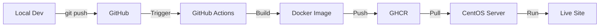

# System Architecture - Complete Frappe LMS Deployment

## Overview

Your deployment includes three layers:

```
┌─────────────────────────────────────────┐
│     frappe_apps (Your Custom App)      │  ← Your custom features
├─────────────────────────────────────────┤
│         Frappe LMS (Main App)           │  ← Core LMS functionality
├─────────────────────────────────────────┤
│      Frappe Framework (Base)            │  ← Backend framework
└─────────────────────────────────────────┘
```

## What Gets Deployed

### Docker Image Contents

The Docker image built by GitHub Actions (`ghcr.io/th3ee-pop/frappe_apps:latest`) contains:

1. **Frappe Framework** (v15.x)
   - Full-stack web framework
   - Database ORM
   - REST API layer
   - Authentication & permissions
   - Background jobs

2. **Frappe LMS** (v2.44.0)
   - Course management
   - Student enrollments
   - Lessons and chapters
   - Quizzes and assessments
   - Certificates
   - Discussion forums
   - Live classes

3. **frappe_apps** (v0.0.1 - Your Custom App)
   - Hello World demo (`/hello`)
   - Custom API endpoints
   - Future: AI learning assistant
   - Future: Custom extensions

## How It Works

### Build Process (GitHub Actions)

When you push code to GitHub:

```yaml
# From .github/workflows/build.yml
apps.json:
  [
    {"url": "https://github.com/frappe/lms", "branch": "main"},
    {"url": "https://github.com/th3ee-pop/frappe_apps", "branch": "main"}
  ]
```

This tells the Docker build:
1. Install Frappe Framework (automatic dependency)
2. Install LMS from official repo
3. Install your frappe_apps on top

### Result

Single Docker image containing **everything**:
- `ghcr.io/th3ee-pop/frappe_apps:latest`

## Deployment Options

### Option 1: Docker Deployment (Recommended for Testing)

Use the docker-compose.yml in the `docker/` directory:

```bash
cd docker
./deploy.sh
```

This deploys the complete system with all apps.

### Option 2: Frappe Cloud (Managed Hosting)

For production without managing servers:
- https://frappecloud.com
- One-click deployment
- Automatic updates
- Managed backups

### Option 3: Manual Bench Deployment

Traditional Frappe deployment:

```bash
bench init frappe-bench
cd frappe-bench
bench get-app lms
bench get-app https://github.com/th3ee-pop/frappe_apps
bench new-site your-site.com
bench --site your-site.com install-app lms
bench --site your-site.com install-app frappe_apps
```

### Option 4: Production Docker (Using frappe_docker)

For serious production deployments, use the official frappe_docker:
- Multi-container setup
- Nginx reverse proxy
- SSL/TLS support
- Horizontal scaling
- Better separation of concerns

See: https://github.com/frappe/frappe_docker

## Current Docker Setup Explained

### docker/docker-compose.yml

Your current setup includes:

**Services:**
- `mariadb` - Database
- `redis-cache`, `redis-queue`, `redis-socketio` - Caching & queues
- `backend` - Frappe web server (includes LMS + frappe_apps)
- `frontend` - Nginx reverse proxy
- `websocket` - Real-time communication
- `queue-short`, `queue-long` - Background workers
- `scheduler` - Cron jobs

**Image Used:**
```
ghcr.io/th3ee-pop/frappe_apps:latest
```

This single image contains Frappe + LMS + frappe_apps!

### Why One Image?

The frappe_docker approach builds layered images:
- Each app layer is added on top
- Final image includes all dependencies
- Simplifies deployment (one image to pull)
- Consistent across all services

## Accessing Features

After deployment at `http://your-server:8080`:

### From Frappe LMS:
- `/lms` - Main LMS interface
- `/courses` - Browse courses
- `/courses/:course/learn` - Take courses
- `/batches` - Manage batches
- Admin: Login → Desk

### From frappe_apps (Your Custom Features):
- `/hello` - Hello World demo
- `/api/method/frappe_apps.api.hello` - API endpoint

## Development Workflow

### Local Development (Current Setup)

Your Mac has the full bench:
```
/Users/chensirui/my-bench/
├── apps/
│   ├── frappe/      # Framework
│   ├── lms/         # Main LMS app
│   └── frappe_apps/ # Your custom app
└── sites/
    └── learning.test/
```

**Commands:**
```bash
bench start  # Run all apps together
bench --site learning.test migrate
bench --site learning.test clear-cache
```

### Production Deployment (Docker)

Your CentOS server runs Docker:
```
/opt/frappe_apps/docker/
└── docker-compose.yml  # Pulls ghcr.io/th3ee-pop/frappe_apps:latest
```

**Commands:**
```bash
./deploy.sh  # Deploy/update everything
docker compose logs -f  # View logs
docker compose restart  # Restart services
```

## CI/CD Pipeline Flow



1. **Edit code** in `/Users/chensirui/my-bench/apps/frappe_apps/`
2. **Commit & push** to GitHub
3. **GitHub Actions builds** Docker image with:
   - Frappe framework
   - LMS app (from frappe/lms)
   - frappe_apps (from your repo)
4. **Image pushed** to `ghcr.io/th3ee-pop/frappe_apps:latest`
5. **On CentOS**, run `./deploy.sh` to pull and restart

## Testing the Complete System

### Test LMS Features:

```bash
# Course listing
curl http://localhost:8080/courses

# LMS home
curl http://localhost:8080/lms
```

### Test Your Custom Features:

```bash
# Hello World
curl http://localhost:8080/hello

# API
curl http://localhost:8080/api/method/frappe_apps.api.hello
```

### Login and Explore:

1. Go to `http://localhost:8080`
2. Login: `Administrator` / `admin` (or your configured password)
3. Access Desk → LMS module
4. Access `/lms` for the LMS interface
5. Access `/hello` for your custom feature

## Scaling Considerations

### Current Setup (docker-compose.yml):
- Single server deployment
- Good for: Development, staging, small production (<1000 users)
- Services on one machine

### For Larger Deployments:

Consider frappe_docker with:
- Load balanced backends
- Separate database server
- Redis cluster
- CDN for static assets
- Multiple worker nodes

See: https://github.com/frappe/frappe_docker/tree/main/docs

## Security Notes

### Development vs Production:

**Development** (current docker-compose.yml):
- Default passwords
- Developer mode enabled
- No SSL/TLS
- Direct port exposure

**Production** (recommended changes):
- Strong passwords in `.env`
- Developer mode OFF
- SSL/TLS with Let's Encrypt
- Nginx reverse proxy
- Firewall configuration

## Troubleshooting

### "App not found" errors:

Ensure all apps are installed on the site:
```bash
docker compose exec backend bash
bench --site lms.localhost list-apps
# Should show: frappe, lms, frappe_apps
```

### Missing features:

```bash
# Migrate database
docker compose exec backend bench --site lms.localhost migrate

# Clear cache
docker compose exec backend bench --site lms.localhost clear-cache

# Rebuild assets
docker compose exec backend bench build
```

### Check app versions:

```bash
docker compose exec backend bench version
```

## Next Steps

1. ✅ Test Hello World feature
2. ✅ Verify LMS functionality
3. ✅ Deploy to CentOS
4. 🔄 Add SSL/TLS (nginx + Let's Encrypt)
5. 🔄 Configure backups
6. 🔄 Add monitoring
7. 🔄 Develop AI assistant features

## Resources

- **Frappe Framework**: https://frappeframework.com
- **Frappe LMS**: https://github.com/frappe/lms
- **Frappe Docker**: https://github.com/frappe/frappe_docker
- **Your Custom App**: https://github.com/th3ee-pop/frappe_apps
- **Documentation**: https://docs.frappe.io
